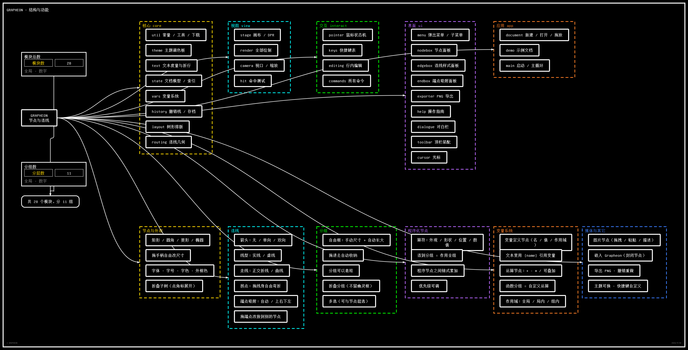

# GRAPHEON

极简 · Undertale UI 风格的**节点与连线编辑器**。

**双击 `index.html` 用浏览器打开即用** —— 零构建、零依赖、不联网。

---

## 风格

纯黑底 + 白色方框 + 红色像素心光标，选中项变黄并冒出一颗红心，
底部是带打字机效果的 `* 对白框`。只有黑、白、黄、红四种颜色。

### 字体：GNU Unifont

全站（含 canvas 与 DOM）都用系统里装的 **Unifont**，字体栈
`Unifont, "GNU Unifont", "Courier New", Consolas, "Microsoft YaHei", monospace`——
没装也能跑，只是失去点阵质感。

Unifont 是按 **16px 点阵网格**设计的（实测 16px 时 ASCII 恰好 8px/字、CJK 16px/字），
所以字号必须取 16 的整数倍：正文 `16`，根节点 / 面板标题 / 导出落款 `32`。
它**只有 Regular 一个字重**，所以全局不使用 `bold`（合成粗体会糊），层级改用「字号 + 颜色」表达。

---

## 核心理念：没有模式，只有节点和连线

早期版本分「思维导图 / 流程图」两种模式，靠模式决定走线和自动排版。
现在**模式取消了**，改成：

- 每条连线自己带一套样式（箭头 / 线型 / 走线），互不影响；
- 节点位置完全手动，想要自动摆一次就点顶栏「排版」。

### 连线类型

选中一条连线（点它），然后在样式面板里改。面板从三个入口打开：
**按 `E`** / **右键 →「连线样式…」**，或者右键菜单里的「箭头 / 线型 / 走线」子菜单直接选。

| 维度 | 取值 |
|---|---|
| **箭头** | 无箭头 · 单向箭头 · 双向箭头 |
| **线型** | 实线 · 虚线 |
| **走线** | 正交折线 · 曲线 |
| **标签** | 连线上的文字（如「是 / 否」） |

三个维度互相独立，所以「虚线的双向箭头 + 曲线」这种组合直接就支持。
新连线默认是 **单向箭头 / 实线 / 正交折线**。

### 拖端点改接

选中连线后，**两端会出现方形手柄**。拖住任意一端就能把它从当前节点上摘下来，
拖到别的节点上松手即改接；松开在空白处 = 取消。

拖动过程中会**按这条线自己的走线方式**实时预览（松手后长什么样，拖的时候就长什么样），
目标节点描边、吸附锚点用小方块标出来。接到自己另一端（自环）、
或者接到已经存在同样连线的节点对，都会被拒绝并给出提示。改接可以 `Ctrl+Z` 撤销。

### 拖端点改接

选中连线后，**两端会出现方形手柄**。拖住任意一端就能把它从当前节点上摘下来，
拖到别的节点上松手即改接；松开在空白处 = 取消。拖动过程中按这条线自己的走线方式实时预览，
目标节点描边、吸附锚点用小方块标出来。接到自己另一端（自环）、
或接到已存在同样连线的节点对，都会被拒绝。改接可以 `Ctrl+Z` 撤销。

### 端点吸附：默认自动，可以钉死

默认每一端都是 **自动**：路由按两个节点的相对位置挑最合适的一对锚点，节点怎么移动它都自己适配。

想固定某一条边从哪个方向进出，就在**节点上右键 →「连线端点吸附…」**：
面板会列出这个节点上的每条连线（先列出边、再列入边），每条都能选
**自动 / 上 / 右 / 下 / 左**。选了方向那一端就钉死在指定边上，不再随相对位置变化。

### 自由调整节点尺寸

选中节点后右下角有**缩放手柄**，拖它就改尺寸。文字会按新宽度重新折行；尺寸有下限，
不会缩没。右键节点 →「恢复自适应尺寸」可以改回随文字自适应。
排版时会按你设定的尺寸来算，不会覆盖它。

### 自由调整连线走向（拐点）

选中一条连线后，**直接拖线身**就能拉出一个**拐点**，把线拽到任意位置。
拐点方块可以继续拖；**双击拐点**或把它拉回直线上（自动判定）就删掉；
右键连线的「拐点」子菜单里还有「在此添加拐点」和「清除全部拐点」。

拐点决定**经过哪里**，而 `走线` 决定**拐角长什么样**：
正交 = 硬折，曲线 = 过这些点的平滑样条。

### 折叠

`Space` 或右键「折叠子树」会把整棵子孙**真的藏起来**（不绘制、点不到、框选和全选也跳过），
折向它们的连线一起收起。父节点边上会出现一个写着数量的角标，**点它就展开**。
折叠期间拖动父节点，展开时整棵子树会按同样的位移跟着走，相对形状不变。
导出时「全部节点」也只看得到可见的部分（所见即所得）；**分组框也会一起导出**（范围里有它的成员就画）。

**分组也能折叠**：选中分组按 `Space`（或右键「折叠分组」）。组内所有后代（节点和分组）藏起来，
**分组框自己留着**，标题右边的角标写着藏了多少个节点，**点角标展开**；
鼠标悬在分组标题上时角标会先露出来，提示这里能点。

还有一条**幽灵框抑制**：一个没被折叠的分组，如果它的内容被别处的折叠全藏起来了，
那它自己也藏起来 —— 否则折叠一个节点会在画布上留下一个空框。
**空分组不受这条影响**（那是你手动画的框，得留着）。套娃时会一层层往外收。

### 节点外观：每个节点都能不一样

选中节点后按 `E`（或右键 →「节点样式…」）打开样式面板：

| 项目 | 可选值 |
|---|---|
| **字号** | 自动（正文 16 / 根节点 32）· 16 · 24 · 32 · 48 |
| **字体** | 默认 Unifont · 等宽 · 黑体 · 衬线 |
| **字色** | 默认 + 9 个预设色 |
| **外框色** | 默认 + 9 个预设色 |
| **尺寸** | 拖节点右下角手柄自由改；面板里可一键恢复自适应 |

所有项目都能选「默认 / 自动」，意思是**跟随主题** —— 没手动改过的节点，换主题时会一起变；
改过的保持你自己的选择。改字号 / 字体会重新折行、重算尺寸；排版时也按你设的尺寸算。

> Unifont 是 16px 点阵字体，`16 / 32 / 48` 是点阵精确的；`24` 能用但边缘会略微柔化。

### 嵌入文档：插入 Grapheon

把**一整份 Grapheon 文档当成一个节点**塞进来：右键空白处 →「新建 ▶ 嵌入 Grapheon…」，
选一个 `.json`。节点里会画一张**内部缩略图**（节点 + 连线 + 名字），顶上一条名称带，
左边标着「封闭」。

**它是封闭的** —— 这是这个功能的核心约束，三处都拦着：

| 位置 | 行为 |
|---|---|
| `linkNodes()` | 直接拒绝，并提示「嵌入节点是封闭的，连不了线」 |
| `linkTargetAt()` | 拖动连线时它不当落点 |
| `hitPort()` / 绘制 | 选中它也不给四个连接端点，连端口都不画（不画一个点不动的假端口） |

历史存档里如果混进了连向嵌入节点的边，**反序列化时直接丢掉**。

#### 进去编辑改的是副本

**双击嵌入节点**进去编辑（右键 →「进入编辑」也行）。进去之后：

- 顶栏出现「**返回**」按钮，右下角提示栏写着「正在编辑嵌入副本 · Esc 或顶栏『返回』回到外层」
- 你可以随便改：加节点、连线、分组、排版，跟平时一模一样
- **按 `Esc` 或点「返回」出来**，里面的改动会写回父文档里那个节点的副本
- **原文件一个字节都不会动** —— 导入的时候就是复制进来的，从来没有回写外部文件的路径

进出用的是**文档栈**，所以嵌入里再嵌一套也没问题。进出会恢复视图、选中状态和撤销栈；
退出时会额外入一次历史（因为父文档确实被改了）。

> 在嵌入文档里**不写自动存档** —— 否则会把外层的存档冲成内层内容，万一崩了外层就找不回来了。
> 内层的改动由 `exitEmbed()` 写回父文档，那时才存档。


四条入口都能加图，最后都汇到同一个函数，行为一致：

| 入口 | 说明 |
|---|---|
| **直接把图片文件拖进窗口** | 落在鼠标松开的位置 |
| **右键空白处 →「新建 ▶ 图片…」** | 落在右键的位置 |
| **顶栏「图片」按钮** | 落在视口正中 |
| **`Ctrl+V` 粘贴** | 从剪贴板里的图，落在视口正中 |

一张图片节点的样子：

```
┌────────────────────────────┐
│                      名称   │  ← 右上角，双击这里改名
├────────────────────────────┤
│           图 片             │
├────────────────────────────┤
│ 描述文字，自动折行           │  ← 双击这块改描述
└────────────────────────────┘
```

- **双击右上角改名**，**双击图片下方写描述**（描述允许换行）。两块位置不同，编辑的是两个独立字段。
- **拖右下角改宽度**，图片按原始比例等比缩放，高度自己跟着走。
- 右键图片节点还有「换一张图片…」「编辑描述…」「编辑名称…」。
- 图片节点就是普通节点：能连线、能进分组、能被折叠、能被程序节点作用。

#### 图片是内嵌的，不是外链

导入时先**等比缩到最长边 900px 以内**，再转成 data URL 存进节点（`node.image`）。
PNG 结果超过约 700KB 就改用 JPEG 0.82 压一道。所以存档是自包含的 —— 换台机器打开也在。

代价是**体积**：一张图内嵌后常见几百 KB，而 `localStorage` 只有 5MB 左右。
存很多大图时建议用「保存」导出成 JSON 文件，别只靠自动存档。

> 反序列化会校验 `image` 必须是 `data:image/` 开头，外链和 `javascript:` 之类一律丢掉。
> 导出 PNG 前会先等所有图片解码完，免得导出的是「图片加载中…」占位。

### 分组

选中**两个以上**节点 → `Ctrl+G`（或右键）成组。

分组框**尺寸自己存着，你拉的尺寸是下限**：拉多大都行，但拉不到比成员还小；
成员顶出去时框会自动长大包住它，成员回来了框也不会缩回去。

- **连接关系完全不变**：分组只是个容器，成员之间、成员对外的连线一条都不动。
- **新建时**会给一个刚好装下成员的框；之后**拖右下角手柄**随便改大小。
  拉太小会被夹回成员的外接框，所以「框装不下成员」这个状态不会出现。
- **只长不缩**：往左上扩的时候框的原点会一起挪，右下角不会漂。
- **排版（`Ctrl+L`）之后框会自动跟上**：排版是显式的全局重排，成员都被摆到新位置了，
  所以每个非空框会**重新贴合**到自己的成员（这一步允许收缩，否则会留下一个盖住半个画布的大框）。
  空框不动 —— 那是你手动拉的尺寸，没有成员可参照。
  「只长不缩」是**拖拽**时的规矩（局部操作）；排版是整体重排，规矩不同。
- **拖进 / 拖出自动收纳**：把节点拖进框里（中心落在框内）就自动成为成员，
  拖出去自动移出。框的大小不变，成员关系只跟着「拖动节点」这个动作走
  —— 排版、改框大小都不会误伤成员关系。
- **拖标题栏 / 边框**整体搬动这个框和组内所有节点，相对位置不变。
- 也可以**右键空白处 →「在此新建空分组框」**，先画框再往里拖东西；空框不会自动消失。
- **双击标题栏**（或 `F2`）改分组名；右键的「颜色」子菜单直接选色，还能把框收缩到刚好包住成员。
- **外框有上下左右四个端点**，和节点完全一样：可以从分组拉线到节点，
  也可以把别的线连到分组上（此时分组整体充当一个端点，走的就是分组自己的四条边）。
- **端点吸附面板和节点共用同一个**（`ui/endbox.js`），右键菜单里也是同一段代码
  （`pushCommonItems()`），所以「重命名 / 连线端点吸附…」两边行为一致。
- **分组可以套娃**：把分组拖进另一个分组就成了嵌套（也可以右键 →「把选中的（节点 / 分组）加入」）。
  父框会自动长大包住子框；拖父框时，子框和里面**所有**节点一起走。
  环会被自动断掉（不能把分组放进自己或自己的后代里），断哪条边是确定的。
- **绘制和命中都按嵌套层深排序**：祖先先画、子分组叠在上面；点击时最内层先接住。
- **分组框可以多选，也能和节点混选**：Shift 点标题栏追加 / 取消，Shift 拖拽框选会把
  **整个框都被框住**的分组一起选上。拖动时选中的分组和节点一起走；`Del` 一次解散全部选中的分组；
  `Ctrl+G` 把选中的节点和分组一起组成新分组（已经是子分组成员的节点不会重复收进来）。
- **多选时只高亮，不给端点和缩放柄**（那些是单目标操作，糊成一片没法用）；
  「整个选择就一个分组」时才出端点和缩放柄。
- **点框内部只会选中里面的节点**，只有标题栏和边框那一条能抓分组，不会挡住成员。
- 选中分组按 `Del`（或右键「解散分组」）= **解散容器**，成员节点和连线全部保留。

### 变量系统

四件东西拼起来：**变量定义节点**、文本里的 `{name}` 引用、**运算节点**、**函数分组**。

#### 变量定义节点

```
┌──────────────────────────────┐
│ 描述文字（左上角）             │
│ ┌──────────┐ ┌─────────────┐ │
│ │ 变量名    │ │ 变量值       │ │  ← 两个输入框，双击分别编辑
│ └──────────┘ └─────────────┘ │
│ 全局 · 数字                   │  ← 作用域 / 值类型
└──────────────────────────────┘
```

| 作用域 | 谁能用 |
|---|---|
| **全局** | 画布上任何节点 |
| **局内** | 只有它的**下游**（沿连线能走到的节点） |
| **组内** | 把这个变量节点**连到一个分组**，那个分组里的节点才能用 |

值类型分**数字**和**字符串**：数字参与 `+ - * /`，字符串只有 `+`（拼接）。

#### 文本里引用：`{name}`

普通节点（以及变量节点的描述）的文本里写 `{name}` 就会被替换成变量的值。

- 想打出**字面的** `{name}`，前面加个反斜杠：`\{name}` → 显示 `{name}`
- 变量不存在 → 显示 `[未定义]`
- 替换是**派生的**：`n.text` 永远是你写的原文，只是**显示**和**量宽**用替换后的结果。
  所以删掉变量定义节点，引用它的地方会立刻回到 `[未定义]`，撤销栈也干干净净。

#### 运算节点

```
┌──────────────────────────────┐
│ 描述文字（左上角）             │
│        ┌────┐ ┌────────────┐ │
│        │ +  │ │ 5          │ │  ← 双击算符框轮换 + - * /
│        └────┘ └────────────┘ │
└──────────────────────────────┘
```

**变量定义 → 运算节点 → 消费者**：消费者看到的不再是变量的原值，而是**沿路运算过**的值。
多个运算节点可以叠加（`(2+3)*4`），而**不在那条路上的分支不受影响**。

> 这一点早先写错过：求值时用一个共享累加器走 BFS，结果一条分支上的运算泄漏到了兄弟分支。
> 现在每条路径各带各的值，有专门的断言盯着。

#### 三种特殊变量控件

变量定义节点可以挂三种**控件**（右键「控件 ▶」，或节点面板里的「控件」一行）。
它们共用变量节点的名字、作用域、优先级、`{名字}` 引用 —— 只是值的来源不同。

**勾选节点**：选项随便加（右键「编辑选项…」，逗号分隔），点方框勾 / 取消。
输出是**选中的那一串**，比如 `牛肉, 辣椒`。

**滑条节点**：上下限 + 步长可设（面板里三个数字框，或右键）。拖圆点**实时**改值，
值自动夹在上下限里并对齐到步长。引用它的地方跟着变。

**开关节点**：放在连接中间。**接通时值正常往下流；断开时这条连接在逻辑上断开** ——
下游拿到的就是 `[未定义]`，局内作用域的下游判定也一样不算数。

> 这里有个坑值得记一笔：求值器「够不着目标就退回变量自己的值」这个兜底，
> 会把开关的效果吃掉 —— 值明明被挡了，却因为兜底而照样显示出来。
> 所以加了 `VAR_BLOCKED` 这个哨兵值，把「够不着」和「被挡住」分开：
> 够不着才兜底，被挡住就是真的没有值。

#### 任何可编辑文字都能引用变量

不只是节点正文 —— **图片描述、连线标签、分组标题**里写 `{名字}` 一样会被替换
（函数分组的 `ƒ` 前缀也照样加）。四处都走 `refreshVarText()` 算出来的派生表，
裸字段永远是你写的原文。

#### 输出节点

新节点类型，**只有一个字段：变量名**。它自己不带值 —— 值从**入边**流进来；
没入边就按名字去同作用域里找一个变量定义。

作用域**由放在哪儿决定，不用手选**：

| 放在哪 | 代表什么 |
|---|---|
| 顶层文档 | 整份文档的输出值；这份文档被嵌到别处时，外层可以取 |
| 函数分组内 | 那个函数分组的输出值 |
| 嵌入文档内 | 那个嵌入文档的输出值 |

**每个作用域只有一个输出节点生效**（按文档顺序取第一个），其余画面上标「未生效」。

跨层引用用 `{嵌入节点名.输出名}`：

```
子图  ← 一个嵌入了别的 .json 的节点
答案 {子图.answer}    ← 取那份文档里名为 answer 的输出节点的值
```

#### 函数分组

函数分组的语义是这样闭环的：

- **输入**：组内的**变量定义节点**
- **运算**：组内的**运算节点**
- **输出**：组内的**输出节点** —— `functionResult()` 就是找它

外面一个变量节点指向这个函数分组，拿到的就是它的输出值。
**组内没有输出节点就是空**（显示 `[未定义]`），不会退回变量自己填的值。

#### 函数分组内外完全隔离

一个变量节点的「全局」指的是**它所在的函数分组内部的全局**，「局内」指的是
**组内的下游**。跨过分组边界互相都看不见 —— 组内看不到外面的全局变量，
外面也看不到组内的。


右键分组 →「设为函数分组」，标题前面会出现 `ƒ`。

一个变量节点**指向函数分组**时，它的值就变成**组内算出来的值** —— 相当于自定义的运算节点。

**函数分组的运算只看组内**：只有「两端都在组内」的边才参与计算。
外部节点接到组内节点上的边，一律不算。

#### 优先级

| 节点 | 默认优先级 |
|---|---|
| 变量定义节点 | **1000（最高）** |
| 运算节点 | 100 |
| 其它 | 0 |

变量定义优先级最高，所以它先算出来给别人用。程序节点的优先级可以**手动设**
（右键 →「优先级」或节点面板），决定算符叠加的先后；同优先级时按文档里的连线顺序。

### 程序化节点

一种可视化编程节点：**连到普通节点上，就改变它的外观 / 数值 / 位置**，而且**可以累加**。

右键空白处 →「新建 ▶ 程序节点」，或者右键任意节点 →「转成程序节点」。
画出来是**双线外框 + 左边一个 ▶**，一眼看得出来。

| 作用 | 项目 | 说明 |
|---|---|---|
| **外观** | 字号 / 字色 / 外框色 / 字体 | 字号可「累加 +8」也可「覆盖 = 32」 |
| **形状** | 矩形 / 圆角 / 菱形 / 椭圆 | 覆盖 |
| **位置** | 横向偏移 / 纵向偏移 | 累加 |
| **数值** | 数值 | 可累加（`+=`）也可覆盖（`=`） |

**累加规则**：沿着「从程序节点出发、指向目标」的那条线施加算符。一个目标被多个程序节点指到时，
**按边在文档里的先后顺序依次叠加** —— `+8` 再来个 `+4` 就是 `+12`；`set` 类算符后写的覆盖先写的。
（把两条线的顺序倒过来，结果就会不同，这是有意设计的。）

**可以作用在分组上**：线连到分组而不是某个节点时，算符落到**组内每一个节点**上（套娃会一路挖到底）。

**程序节点之间可以链式累加**：`数值` 算符作用在另一个程序节点上时，改的是**它的操作数**。
于是 `(数值+=3) → (数值+=4) → 目标` 会让目标拿到 `4 + 3 = 7`。链条会迭代到不动点，
遇到环最多跑 6 遍就停 —— 有界，不会死循环。

被作用过的目标节点：**右上角一个黄点**，数值型的还会在**右下角显示累计结果**（`= 12`）。

#### 实现上最要紧的一条：效果是「派生」的

算符**绝不写回节点本身**，只写进一份派生的效果表：

```js
refreshEffects();          // reindex 末尾跑一次，按边序把所有算符叠出来
effColor(n) / effFsPx(n) / effShape(n) / effValue(n)   // 读有效值
nodeBox(n)                 // 有效盒子：x/y 带上位移，shape 带上形状
```

渲染、命中测试、连线锚点、分组外接框、包围盒**一律读有效值**，节点裸字段永远是你自己设的那份。

这么做换来两个直接好处：

1. **撤销栈干净** —— 撤销的永远是「用户做了什么」，而不是算符算出来的中间状态；
2. **删掉程序节点，目标立刻复原** —— 因为目标从来就没被改过。


### 顶栏

```
撤销 重做 | 新建 打开 保存 导出 | 插入 视图 | 设置 ? 刷新
```

- **插入**：节点 / 图片 / 嵌入 Grapheon / 变量定义 / 运算 / 输出 / 勾选 / 滑条 / 开关，
  所有「加一个 X」都收在这里
- **视图**：居中 / 排版 / **居中并排版**（原来那两个按钮并进来了）
- **设置**：主题 / 背景 / 默认节点外观 / 新连线样式 / 快捷键（见下）
- **刷新**：重新加载页面（会先问一句，免得丢掉没保存的改动）

### 主题与背景

主题除了调色板，还带三样「性格」：`grid`（背景样式）、`heart`（画不画那颗决心红心）、
`star`（对话栏和标题前那个星号）。

| 主题 | 背景 | 红心 | 星号 |
|---|---|---|---|
| **棋盘**（默认） | 棋盘格 | 无 | 无 |
| Undertale | 横纵网格 | 有 | 有 |

背景可以在设置里单独覆盖：**跟随主题 / 横纵网格 / 棋盘 / 点阵 / 无**。

**「不要红心」是一颗都不留**：红心在这个项目里一共三处 —— 节点旁边的选中标记（canvas 里画）、
跟着鼠标的光标（`#heart`）、菜单 / 选项 / 按钮前面那个小标记（`.hrt` 和 `.ud-btn::before` 的
CSS mask）。前一处由 `themeHeart()` 控制，后两处靠 `body.no-heart` 一次清掉。

> 这里踩了个 CSS 特异性的坑：清遮罩的规则写成 `body.no-heart .hrt`（0,2,1），
> 而原规则是 `#set .opt .hrt`（1,2,0）—— **id 赢**，所以必须 `!important`。

加一套新主题只要往 `THEMES` 里加一项。

### 设置

设置面板（顶栏「设置」，`Esc` 关）里有：

- **主题**：棋盘 / Undertale
- **背景**：跟随主题 / 横纵网格 / 棋盘 / 点阵 / 无
- **默认节点外观**：字体 / **字号滑条**（0 = 自动，拖动时数字实时跟着变，松手才落盘）/ 从文件加载字体
- **新连线**：箭头样式
- **快捷键**：列出当前全部绑定，一键恢复默认

改完立刻生效，全部存 `localStorage`，没有「确定 / 取消」。

> 背景样式是从主题里拆出来单独存的（`grapheon.grid.v1`），
> 这样「跟随主题」和「我就要点阵」两种诉求都能满足。

### 防止节点重叠

**默认开启**：拖一个节点压到别人身上，被压的会自动弹开（沿重叠更小的那个轴推，
位移最小），被拖的那个不让路，所以手感是跟手的。弹开之后留 16px 的缝。

关掉之后可以随便叠。开关在**右键空白处 / 右键节点**的菜单里，也有一项
「弹开所有重叠的节点」可以手动清一次（这一项无视开关）。

设置存在 `localStorage` 的 `grapheon.overlap.v1`。

> 只挂在**交互路径**上（拖拽结束、缩放结束、手动弹开），不挂在 `addNodeAt` 上。
> 程序化铺文档时需要能精确指定坐标，自动弹开会把布局搞乱。

### 排版


顶栏「排版」/ `Ctrl+L`：按树形（以没有父节点的节点为根、子树按高度贪心分到左右两侧）
把节点摆一次。这是**一次性操作**，之后随便拖，不会再被自动排版覆盖。

---

## 操作

| 按键 | 作用 |
|---|---|
| `方向键` / `WASD` | 在该方向生成新节点并自动连好线（自动避开同一排的节点） |
| `Tab` | 添加子节点 |
| `Enter` | 添加兄弟节点 |
| `Ctrl` + 方向键 | 只跳转选择，不新建 |
| `E` | 样式面板：选中节点开节点样式，选中连线开连线样式 |
| `Ctrl+G` | 把选中的多个节点加入分组 |
| 拖节点进/出分组框 | 自动收纳 / 自动移出（归属最内层） |
| 拖分组进分组 | 套娃 |
| Shift 点分组标题 | 分组多选（可以和节点混选） |
| 拖分组框右下角 | 调整框的大小（下限是成员外接框） |
| 拖连线端点 | 改接到别的节点 |
| 拖已选中的连线 | 拉出拐点，自由改走向 |
| 拖拐点方块 / 双击拐点 | 移动 / 删除拐点 |
| 拖节点右下角手柄 | 自由调整节点尺寸 |
| 节点右键「连线端点吸附…」 | 把某一端钉在上/右/下/左任意一条边 |
| 点节点上的数字角标 | 展开被折叠的子树 |
| 选中分组按 `Space` | 折叠 / 展开整个分组（角标在标题右边） |
| 拖图片进窗口 / 右键「新建 ▶ 图片…」 | 加一个图片节点 |
| 右键「新建 ▶ 嵌入 Grapheon…」 | 把一整份 .json 当成一个封闭节点嵌进来 |
| 双击嵌入节点 / 按 `Esc` | 进去编辑副本 / 返回外层 |
| 双击图片右上角 / 图片下方 | 改名称 / 写描述 |
| `Shift` + 拖拽空白 | 框选 |
| 拖拽空白 / 中键拖 | 平移画布；滚轮缩放 |
| 双击空白 / 节点 / 连线 | 新建自由节点 / 改名 / 改标签 |
| `Shift` + 点击两个节点 | 快速建立连线 |
| `F2` | 重命名（`Shift+Enter` 换行） |
| `Delete` | 删除选中的节点（连同子孙）或选中的连线 |
| `Space` | 折叠 / 展开子树 |
| `Ctrl+Z` / `Ctrl+Shift+Z` | 撤销 / 重做 |
| `Ctrl+S` / `Ctrl+O` | 保存 JSON / 打开 JSON（也支持拖文件进来） |
| `Ctrl+E` | 打开导出面板 |
| `Ctrl+L` | 按树形排版 |
| `Ctrl+A` | 全选节点 |
| `H` / `?` | 操作指南 |

## 导出

顶栏「导出」或 `Ctrl+E`：

- **导出范围**：全部节点 / 仅选中的节点 / 选中的子树（按当前选择动态启用）。
  底部实时显示「将导出 N 个节点 · M 条连线 · W × H 像素」。
  连线只保留**两端都在导出范围内**的，不会拖出线头。
- **标题**：填了就以 32px 白字画在图片**左上角**，过长自动截断加省略号。
- **文件名**：默认 `grapheon-YYYY-MM-DD`，自动清理 Windows 非法字符。

文件名 / 标题 / 上次的范围都会记住。输出固定 2× 分辨率，带白框、左下角水印、右下角日期。

## 新建

顶栏「新建」是菜单：**空白文件**（一个中心节点）/ **示例文档**。会覆盖当前内容与自动存档。

---

## 目录结构

```
index.html                 只有 DOM 结构与引用，不含任何逻辑
styles/
  theme-undertale.css      主题变量 + 全部样式
src/
  core/    纯逻辑，不碰 DOM
    util.js                常量、调色板、可选字体/颜色表、面板通用控件、统一下载通道
    theme.js               主题注册表（DOM 与 canvas 共用一份调色板）
    text.js                文本度量、中英混排换行、节点尺寸（按各自字体字号）
    state.js               文档模型、id 分配、父子索引、分组、程序效果（派生）、序列化
    vars.js                变量系统：插值、作用域、运算节点、函数分组、优先级
    history.js             撤销 / 重做栈、localStorage 自动保存
    layout.js              树形排版（一次性）；relayout() 只重算尺寸
    routing.js             连线几何：四向锚点、正交折线、贝塞尔、拐点样条、端点吸附
  view/
    stage.js               canvas 元素与 2D 上下文、DPR / 视口尺寸
    render.js              绘制：网格、连线（按各自样式）、节点、端口、拖端点预览
    camera.js              世界坐标 ↔ 屏幕坐标、居中适配、以光标为中心缩放
    hit.js                 命中测试：节点 / 端口 / 连线 / 手柄 / 拐点 / 缩放柄 / 角标 / 分组
  interact/
    editing.js             节点文本与连线标签的行内编辑
    commands.js            结构操作 + 连线样式操作
    pointer.js             鼠标状态机：框选、平移、拖拽、缩放、拉新线、改接、拉拐点、搬分组
    keys.js                快捷键绑定表 + 动作注册表
  ui/
    dialogue.js            底部打字机对白栏
    menu.js                通用弹出菜单（支持多级子菜单；右键菜单、「新建」菜单都复用它）
    help.js                操作指南浮层
    exporter.js            导出面板
    edgebox.js             连线样式面板（箭头/线型/走线/标签）
    endbox.js              连线端点面板（钉死某一端接在哪条边）
    nodebox.js             节点面板（程序算符 + 字号 / 字体 / 字色 / 外框色 / 尺寸）
    cursor.js              红心光标跟随
    toolbar.js             顶栏按钮绑定（装配层，必须在最后）
  app/
    document.js            模式无关的文档操作：新建 / 打开 / 保存 / 拖入
    demo.js                首次打开时的示例文档
    main.js                启动引导与主循环
tests/
  regression.js            967 项断言
  run.mjs                  在真实 Edge 里跑断言：node tests/run.mjs
```

### 为什么是普通脚本而不是 ES module

模块之间共享同一个全局作用域，所以**双击 `file://` 直接打开就能跑**。
ES module 在 `file://` 下会被 CORS 拦掉，想保留「双击即用」就必须放弃 `import`。

### ⚠ 三个必须记住的约束

**1. 加载顺序 = 依赖顺序。** 函数声明只在**自己那个脚本**里提升。所以
`onclick = saveFile` 这种「加载期就把函数当值取出来」的写法，要求 `saveFile` 所在模块
必须**先加载**；否则那一行会抛 `ReferenceError`，而且**该脚本后面的所有代码一起不执行**。

> 这个坑真踩过：`ui/toolbar.js` 曾排在 `app/document.js` 前面，结果保存/导出/居中/帮助
> 四个按钮一起失效。现在 `toolbar.js` 排在最后、且一律用箭头函数包一层（点击时才解析），
> 测试里也有专项断言（A02/A03）盯着每个按钮。

**2. 下载只有一条路径。** 保存 JSON 和导出 PNG 都走 `core/util.js` 的 `downloadBlob()`。

**3. 别缓存节点引用。** `deserialize()` 会整体重建 `doc.nodes`，之前拿到的对象就过期了；
要拿当前文档里的节点用 `byId()` / 现查。测试里踩过这个（`root` 变量拿到旧对象）。

---

## 数据格式

`localStorage` 和导出的 JSON 都是 `v:2`：

```json
{ "v": 2, "nid": 120,
  "groups": [{ "id":"g1", "title":"前置处理", "members":["n1","n2","g2"], "color":null,`n              "collapsed":false, "x":0, "y":0, "w":320, "h":220 }],
  "nodes": [{ "id":"n1", "text":"甲", "x":0, "y":0, "shape":"rect",
              "collapsed":false, "fixedW":null, "fixedH":null,
              "font":null, "fsPx":null, "color":null, "border":null, "kind":"node" }],
  "edges": [{ "id":"e1", "s":"n1", "t":"n2", "label":"是",
              "arrow":"both", "dash":true, "route":"curve",
              "aSide":null, "bSide":null,
              "waypoints":[{ "x":400, "y":120 }] }] }
```

| 字段 | 含义 |
|---|---|
| `fixedW` / `fixedH` | 手动拖过的尺寸；`null` = 随文字自适应 |
| `aSide` / `bSide` | 端点钉在哪条边上（`r`/`l`/`t`/`b`）；`null` = 自动吸附 |
| `waypoints` | 手动拐点；`null` = 按走线方式自动路由 |
| `collapsed` | 节点：折叠子树 / 分组：折叠组内后代（子孙会被隐藏） |
| `isFunction` | 分组：是不是函数分组 |
| `font` / `fsPx` | 字体 id / 字号；`null` = 跟随主题 |
| `color` / `border` | 字色 / 外框色；`null` = 跟随主题 |
| `kind` | `node` / `program` / `image` / `embed` / `var`（变量定义）/ `op`（运算）/ `out`（输出） |
| `outDef` | 输出节点：`{ name }` |
| `varDef` | 变量定义节点：`{ name, value, type, scope }` |
| `opDef` | 运算节点：`{ op, operands:[...], type }`（`operands` 的长度由算符的 arity 决定） |
| `priority` | 手动设的优先级；`null` = 用 kind 的默认值 |
| `embed` | 嵌入的整份文档 `{ doc: <一份完整的 v2 文档> }` |
| `image` / `imgW` / `imgH` | 内嵌的 data URL / 图片原始宽高（比例靠它保持） |
| `desc` | 图片节点的描述文字 |
| `value` / `program` | 数值型算符累加的结果 / 程序节点的算符 |

`v:1`（有 `mode: "mind"|"flow"`、没有连线样式）的老存档也能直接打开：
读取时会把它一次性翻译成每条线的 `route`（`mind` → 曲线、`flow` → 正交），
其余样式补默认值，打开后长相不变。详见 `deserialize()`。

---

## 扩展

### 加一个主题

在 `src/core/theme.js` 的 `THEMES` 里加一项（`canvas` 的键就是画布用的颜色），
调 `applyTheme('xxx')` 即可 —— 它同时改画布调色板 `C` 和 CSS 变量并存盘。

调色板只有这一处定义：CSS 变量名与 `THEME_VARS` 一一对应，DOM 和 canvas 永远一致。
按钮悬停的像素心、鼠标红心、画布上选中节点的红心**都是 `--r` 驱动的遮罩/填充**，会一起变色。

### 改快捷键

```js
GP.keys.bind('ctrl+d', 'node.delete');   // 改绑（同一个动作只保留一个键，旧键自动释放）
GP.keys.unbind('w');                     // 解绑
GP.keys.reset();                         // 恢复默认
GP.keys.rows();                          // 列出所有绑定（带中文标签，可直接喂给设置面板）
```

默认值在 `src/interact/keys.js` 的 `defaultBindings()`。加新动作：往 `ACTIONS` 里加
`{ label, group, run, overlay? }`；`run()` 返回 `false` 表示「当前不适用」，
会交回给兜底逻辑（`e` 键就是这么做的：选中连线时开样式面板，否则起手改名）。

### 加一条连线的样式维度

1. `core/state.js`：在 `EDGE_DEFAULTS` / `normalizeEdge()` 里加字段和合法取值；
2. `view/render.js`：`drawEdge()` 里按新字段改绘制；
3. `ui/edgebox.js`：加一组 `buildOpts(...)` 即可（选项组是数据驱动的）。

### 加新菜单

`src/ui/menu.js` 的 `showMenu(x, y, items)` 是通用的。`items` 里每一项是：

| 写法 | 含义 |
|---|---|
| `'hr'` | 分隔线 |
| `[标签, 快捷键提示, 回调]` | 普通项；回调传 `null` 就是灰掉的不可点项 |
| `[标签, 提示, null, 子项数组]` | 带子菜单，鼠标移上去往右展开（右边放不下自动翻到左边） |

子菜单可以嵌套任意层。菜单项太多会看不清，所以**按功能分层**：

| 菜单 | 子菜单 |
|---|---|
| 节点 | 形状 / 分组 |
| 连线 | 箭头 / 线型 / 走线 / 拐点 |
| 分组 | 颜色 |
| 空白处 | 新建 |

子菜单里的**当前值前面带 `●`**，点一下直接切过去（不是「点一次循环一个」）。
`radioSub()` 和 `colorSub()` 就是生成这两种单选子菜单的小工具。

### 加新面板

面板统一贴在**右下角、下方提示框的正上方**。位置由 CSS 里的 `--dlg-h` 决定，
而 `--dlg-h` 是 `ui/dialogue.js` 用 `ResizeObserver` 量出来的提示框高度
（提示文字会换行，高度不固定，所以不能写死）。

新面板只要写 `position:fixed` 的样式并把 id 加进那组选择器就行，
不用自己算位置。

---

## 测试

```bash
node tests/run.mjs          # 在真实 Edge 里跑 967 项断言；退出码 0 = 全过
node tests/run.mjs --keep   # 保留临时页面，方便手动打开看控制台
```

覆盖范围：架构（模块确实分开了、`GP` 扩展点存在、**加载期无未捕获错误**、模式按钮已移除）、
顶栏装配（9 个按钮都绑了处理函数、**每个点下去都真的有效果**、保存走统一下载通道）、
字体与主题、核心结构（排版无重叠、坐标换算、序列化往返、**老 v1 存档的样式翻译**）、
连线类型（默认值、按各自 route 渲染、箭头端点几何、样式面板的打开/同步/切换/关闭、
`E` 键的双重语义、右键菜单项）、拖端点改接（手柄命中、改接成功、落空取消、拒绝自环、
拒绝重复连线、可撤销）、
**折叠子树**（真隐藏、角标可点开、框选/全选/导出都跳过、展开时子树跟着父节点位移、
连隐藏子孙一起删、状态可存）、
**端点钉位**（默认全自动、右键面板、指定后几何真接在那条边、不随相对位置改变、可恢复自动、可存）、
**节点自由缩放**（拖手柄、有下限、恢复自适应、排版按固定尺寸算且不重叠、可存）、
**连线拐点**（拖线身生成、拖拐点、拉直自动收掉、双击删除、右键加/清、曲线走样条、可存、可命中）、
**节点外观**（默认全跟随主题、面板选项齐备、改字号/字体重算尺寸、颜色真的用上、
一键恢复默认、非法值被规整、可存）、
**嵌入文档**（建节点、封闭（三处拦截 + 反序列化丢边）、进出编辑、改的是副本而父文档结构不变、
嵌套嵌入、视图/选中/历史栈恢复、退出入历史、嵌入期间不写自动存档、手动尺寸、存读往返、
空文档与残缺数据不崩、参与选中/分组/折叠但不能连线）、
**图片节点**（建节点、尺寸=名称带+等比图+描述、窄图不拉宽、超宽有限宽、
拖手柄等比缩放、三块命中、双击分别改名称/描述、描述换行、连线与程序作用、存读往返、
外链与非 data:image 一律过滤、非法 kind 规整、参与选中/分组/折叠、导出前等解码、
**完整导入链路**（canvas→blob→File→导入）、非图片被挡、换图保留名称描述）、
**分组多选**（Shift 追加/取消、拖动一起走、Del 批量解散、Ctrl+G 收分组、多选不给手柄、
混选节点、框选整个框、元信息、全选含分组、单选/清空的状态转换）、
**主题 / 背景 / 设置面板 / 字体**（棋盘主题一颗红心都不留（class + 计算样式都验）、
选项选中项高光、字号滑条实时读数与落盘、从文件加载字体（坏文件被挡、家族名清洗）、
**主题 / 背景 / 设置面板**（默认主题是棋盘、无红心无星号、四种背景各画一次比像素、
关掉背景底上不留格子、切主题红心回来、星级主题摘掉/保留对话开头的星号、
主题与背景落盘且重开还记得、设置面板开合与内容、面板之间不叠、
顶栏 11 个按钮全部真的有效果）、
**三种特殊控件 + 任意文字引用变量**（连线标签 / 分组标题 / 图片描述里引用变量、
改一个字就重算、控件改名共作用域、勾选选项与输出串、滑条对齐步长与夹上下限、
按坐标拖滑条、开关断开后值过不去且不算下游、控件命中区、控件存读往返）、
**输出节点 / 函数分组 / 运算符表**（输出节点、有入边取值、无入边按名字取、顶层输出、
函数分组的输出由它决定、没有输出就是空、每个作用域只有一个生效、**函数分组内外完全隔离**、
{嵌入名.输出名} 跨层引用、不污染当前文档、存读往返、**运算符注册表**（arity 驱动布局/
命中/面板/求值，现场塞一个双输入算符验证它自动跟上））、
**防止节点重叠**（默认开、碰撞时推谁、留缝、关掉可叠、手动弹开无视开关、
全部堆在一起也能拆干净、节点一个不少）、
**连到分组的线能存读往返**、
**变量系统**（变量节点、三种作用域各自的可见性、{name} 插值、\\{ 转义、[未定义]、
插值参与量宽、运算节点沿路径生效、多运算叠加、四种算符、除零、字符串拼接、
**每条路径各带各的值**（分支不互相污染）、函数分组、函数分组只看组内边、
优先级与同名变量的取舍、派生性（不写回裸字段）、删掉定义就回到未定义、存读往返、分部命中）、
**分组折叠**（组内后代藏起来、框留着、角标可点开、幽灵框抑制、空框不受影响、套娃逐层收、可存、藏起来的框点不到）、
**分组自由框**（至少两个节点才能成组、成组不动连线、新建时贴合成员、手动尺寸是下限（拉不小）、
成员顶出去自动长大且回来不缩、**排版后自动重新贴合成员**、空框不被排版动、
拖入自动收纳/拖出自动移出、拖标题框和成员一起走、
四个端点可命中可拉线、连线可指向分组、**分组也能用节点那套端点吸附面板**、
空框不会消失、成员被删后自动清理、解散只拆容器、可存、框内部不会挡成员、Ctrl+G）、
**程序化节点**（创建、没连线不生效、外观/形状/位置/数值四种算符、多个累加、按边序累加、
**作用在整个分组上**（含套娃内层）、**程序节点之间链式累加**、有环时迭代有界、
裸字段不被写回、删掉程序节点目标复原、程序节点之间不叠加、路由与命中都走有效位置、
转换与序列化往返、撤销回退、面板显示有效外观、标题跟着算符自动更新）、
**菜单分层**（根菜单收短、子菜单 hover 才展开、当前值带 ●、点了就生效、不越出视口右边、收起无残留）、
**面板定位**（五个面板都贴提示框上沿、右下角对齐、不顶到顶栏、提示框变高时跟着上移）、
方向生成与 Tab/Enter 结构操作、快捷键表、鼠标状态机、新建菜单、
导出（范围裁剪、标题、文件名净化、真产出 PNG、导出图不含选中态）。

> **运行器会同时收集三种错误**：`Runtime.exceptionThrown`（未捕获异常）、
> 注入在 `<head>` 最前面的 `window.__loadErrors`（加载期错误），以及控制台 error 日志。
> 只收控制台日志是不够的——未捕获异常根本不走那条路。
> 浏览器 profile 每轮都是全新的，否则上一轮留下的 localStorage 会让断言互相污染。

---

---

## 路线图

### Markdown 渲染（计划中）

节点文字目前是纯文本 + 自动换行。计划支持节点内 Markdown（粗体 / 斜体 / 行内代码 / 列表 / 标题），
导出 PNG 时一起渲染。

打算这么做：

1. **不用第三方库** —— Unifont 没有粗体，所以「粗体」只能靠**描边两次**或**换色**来伪造；
   下划线 / 删除线是画线，行内代码是加底色块。这些都和现有的 `wrapText()` / `drawNode()` 对得上。
2. **先解析成行内片段树**（`[{text, bold, italic, code, strike, link}]`），再走现有的折行逻辑 ——
   折行的单位从「字符」变成「片段」，宽度按片段量。这是主要工作量。
3. **语法开关放在节点上**（`node.md = true`），默认关闭，避免 `*` 之类的字符被误判。
4. 导出的 PNG / 未来的 SVG 都复用同一套片段绘制。

---

## 项目结构图



仓库根目录的 `docs-structure.png` 是**用 Grapheon 自己画的**项目结构与功能图：

```bash
node tools/make-structure-diagram.mjs
```

它会起一个无头 Edge 打开注入了 `tools/structure-diagram.js` 的页面，
页面里用 Grapheon 的 API 建出整张图，再走**它自己的导出通道**产出 PNG，
最后通过 CDP 把图取回写成文件。改完代码重跑一次，图就跟着更新。

> 这张图顺带当了一次回归测试：做它的时候发现**导出时指向分组的连线会被整条丢掉**
> （`buildExportCanvas` 和 `drawGraphForExport` 各自过滤了一遍边，只认节点集合），
> 已经修掉并加了断言。